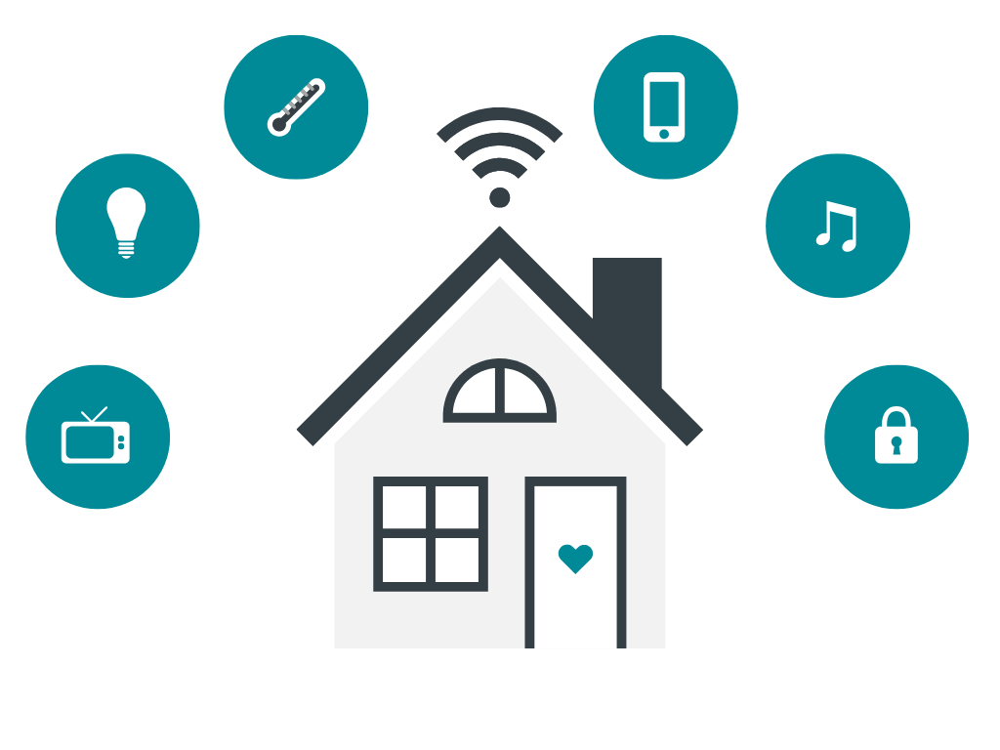

<h1 align="center">Smart Home</h1>

  

---

**Done by:**

1. Ahmed Mohamed Mohamed (Ahmedtorres2000@gmail.com)
2. Mohamed Yasser Elkot (my557364@gmail.com)
3. Jasmin Saber Abd-Elqader (yasmynsabralsyd@gmail.com)
4. Ahmed Bahgat Nagy (ahmedmat60@gmail.com)
5. Amir Mohamed Hassan (@gmail.com)

**Under the supervision:**
Dr. Mohamed Mahmoud Abdelwahab (‪engmohmah1961@gmail.com‬‏)

## 🔬 What is next?

This project will be always improved this project.
So, if you have any suggestion, create an issue <a href="https://github.com/AhmedTorres2000/Smart-Home/issues">here</a></strong> and I will appreciate it.

---

## 💁‍♂️ Contribute

If you want to contribute to the project, you can:

1. Fork the project on your GitHub account.
2. Develop the project on your own.
3. Send a pull request to the project on GitHub.
4. I will review your pull request and add it to the project.

---

## 📞 Contact me

  

## 🔏 Credits

All credits and external sources are listed inside the page and inside this repo, references themselves.
